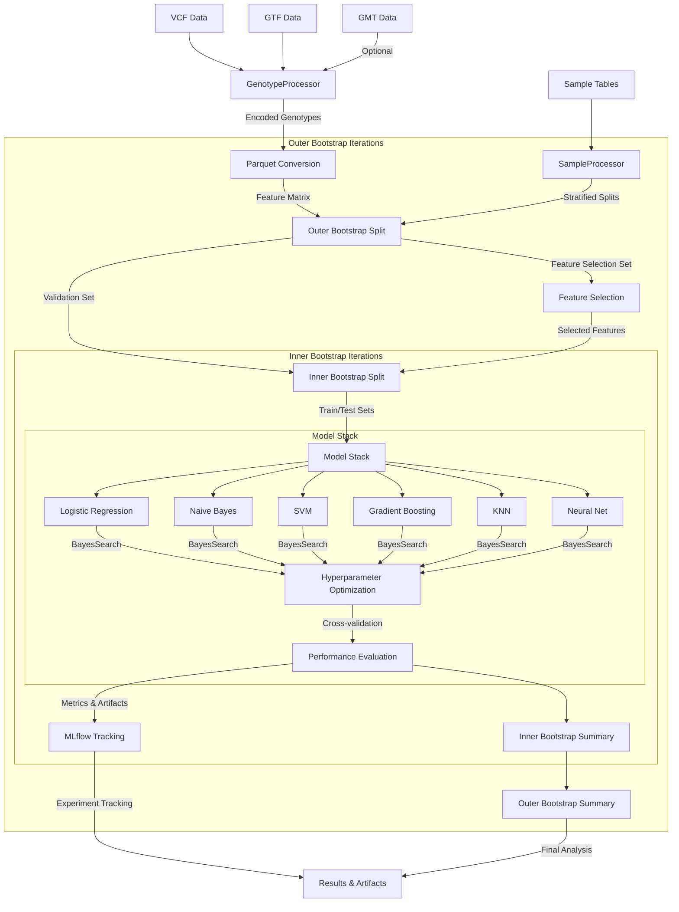

# Genomic Variant Analysis Pipeline

A systematic approach to discovering genomic variants that distinguish disease cases from controls, with potential to identify causal mutations. Built for reproducible analysis of large-scale genomic data through model stacking and bootstrap validation.

## Overview

This pipeline enables:
- Discovery of discriminative genomic variants between cases and controls
- Prioritization of potentially causal mutations through feature importance
- Statistical validation through nested bootstrap resampling
- Tracked experiments with detailed metrics and artifact logging
- Scalable processing of large genomic datasets
- Interactive development and debugging capabilities

## Architecture



## Core Components

- **Data Processing**: Specialized processors for genotype and sample data
- **Model Stack**: Ensemble of models optimized for genomic feature selection
- **Validation**: Nested bootstrap sampling for robust performance estimation
- **Results**: Comprehensive metrics, feature importance, and SHAP explanations

## Key Dependencies

- Python >=3.9
- MLflow: Experiment tracking and artifact management
- Hail: Scalable genomic data processing
- scikit-learn & XGBoost: Core modeling
- SHAP: Feature importance analysis

## Getting Started

1. Set up environment:
```bash
# Clone repository
git clone <repository-url>
cd <repository-name>

# Create and activate environment
python -m venv venv
source venv/bin/activate  # or `venv\Scripts\activate` on Windows

# Install dependencies
pip install -r requirements.txt
```

2. Configure MLflow:
```bash
# Set longer timeout for large artifact handling
export MLFLOW_HTTP_REQUEST_TIMEOUT=1200

# Start MLflow server (default: http://localhost:5000)
mlflow server
```

3. Run analysis:
```bash
# via CLI
python src/main.py
```

## Project Structure

```
├── src/
│   ├── data/           # Data processing modules
│   ├── models/         # Model definitions
│   ├── eval/           # Evaluation utilities
│   └── analysis/       # Analysis notebooks
├── tests/              # Test suite
└── mlruns/            # MLflow experiment tracking
```

## Experiment Tracking

Results are tracked through MLflow, including:
- Model performance metrics
- Feature importance scores
- SHAP values
- Confusion matrices
- ROC and PR curves
- Sample-level predictions

Access the MLflow UI at http://localhost:5000 after starting the server.

## Contributing

1. Fork repository
2. Create feature branch (`git checkout -b feature/amazing-feature`)
3. Commit changes (`git commit -m 'Add amazing feature'`)
4. Push branch (`git push origin feature/amazing-feature`)
5. Open Pull Request

## License

MIT License - see [LICENSE](LICENSE) file for details

## Acknowledgments

Built with support from Project MinE and Answer ALS datasets.
